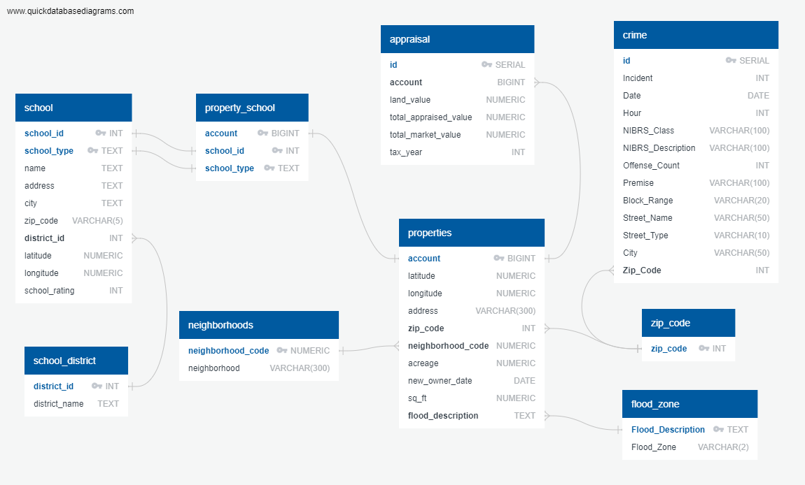

# Real Estate Investment Dashboard

## Project Goal
Real Estate investment research is time consuming because of the lack of a single place to find all the information related to home value tendencies, school ratings, flood zones, crime rate and amount of transactions happening per zip code in Houston. The following dashboard responds to an investor with a ranking of neighborhoods in 9 Zip Codes in the Houston area to invest in. The ranking depends on the investor preferences in terms of budget and importance of 7 parameters: 

## General Workflow
The coding approach was divided in 4 main components:
* 1-	Database: Postgres Database was used to store 9 tables with a total of 150,000 rows where data related to single family properties in 9 selected Zip_Codes in Houston is stored. The data contains property description such as address, latititude, longitude, value, sq_ft, acreage, flood zone, crime risk and schools ratings. This database runs in Heroku cloud server.
* 2-	Python: Python calls the SQL database, where most of the data is filtered and merged in SQL. Then, calculations are done to generate a ranking of the neighborhoods to invest in depending on users criteria.
* 3-	Python Flask: the development of the web application is done thru the Flask web framework. 2 routes were created: 1 for the main page and a second one for the results page.
* 4-	Visualization: HTML and CSS files were generated to create the visualization of the results, using a combination of bootstrap, leaflet and d3.

## Data Used
* School Ratings: 
Source: https://texasschoolguide.org/school-rankings/ 
Download: CSV file
* National Flood Data: 
Source: http://nationalflooddata.com/flood/floodapi/ 
Web request API using street addresses from HCAD dataset
* Harris County Appraisal District (HCAD): 
Source: https://pdata.hcad.org/download/2019
Download: ZIP folders comprised of text files and csv files
* Crime:
Source: https://www.houstontx.gov/police/cs/Monthly_Crime_Data_by_Street_and_Police_Beat.htm
Download: CSV file
* Shape files for layers: https://cohgis-mycity.opendata.arcgis.com/

## Detailed Description

### Database
A Heroku-Postgres database was created based on the following ETL diagram. The data consisted of 9 tables with a total of 150,000 row swhere data related to single family properties in 9 selected Zip_Codes in Houston is stored. The data contains property description such as address, latititude, longitude, value, sq_ft, acreage, flood zone, crime risk and schools ratings. This database runs in Heroku cloud server.

## Python layer
Python processes the data to calculate the 5 top neighborhoods for investment based on the users selected preferences. Python outputs a json file.

## Flask web framework
Python Flask was used for the development of the web application. 2 routes were created, one for the home page and another one for the process of the results.

## Visualizations
### Homepage
* The main part of the screen shows a map with the location of the 9 zip codes of interest.
* The user can view the boundaries and popup information of each of these parameters in a layer.
* The banner in the left, allows the user to go thru the preferences for max budget and the importance for decision about sales frequency, school ratings, crime, flood, value increase of the property, acreage and sq_ft.
* The user presses submit, which triggers the Python processing layer.
* The code then accesses the database and pulls only the data relevant to properties less than the users selected budget.
* The code further processes this data based on the users other input preferences and ranks the neighborhoods.
* The results visualizations are triggered

### Results Page
The code outputs visualizations of the top 5 neighborhoods in the ZIP Codes available and ranked based on the user criteria.

While the data is processing from the user inputs and database pull all outputs are hidden and a progress bar is shown.  The duration of the progress bar animation is
based on average load time for the program.

The visualizations consist of:
1) A map showing the top 5 nieghborhoods locations, with popups for more info about each neighborhood
2) A horizontal bar chart showing the total scores of each neighborhood based on the users inputs.  This chart shows more info when the user hovers over each bar.
3) An interactive bar chart, where the output is determined by the users choice in a dropdown menu.  The bars show more information when the user hovers over them.
4) A table showing the scores for each parameter of each of top 5 neighborhoods calculated from the database information and the users ranks of parameter preference.

The user can also access the raw json data from the api through a multi parameter or budget route.  The accessible API routes are listed when
the user clicks the "APIs" tag on the top navigation menu.
